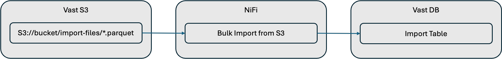

# Bulk Import

The primary purpose of this example is to demonstrate how Parquet data can be bulk imported into Vast DB.

## Overview

Bulk Import uses a NiFi ListS3 processor to monitor a S3 folder for new parquet files.  It then calls a Vast DB processor, ImportVastDB to bulk load the files into a Database table.

You can find out more bulk importing with NiFi [here](https://vast-data.github.io/data-platform-field-docs/vast_database/nifi/bulk_import.html).

## Prerequisites

- Docker Compose
- Host with:
  - approx. 24GB Memory
  - approx. 8 cores
- Vast S3 Bucket
- Vast Database

## Setup Instructions

See [here](./SETUP_INSTRUCTIONS.md).

## Demonstration Instructions

See [here](./DEMO_INSTRUCTIONS.md).

