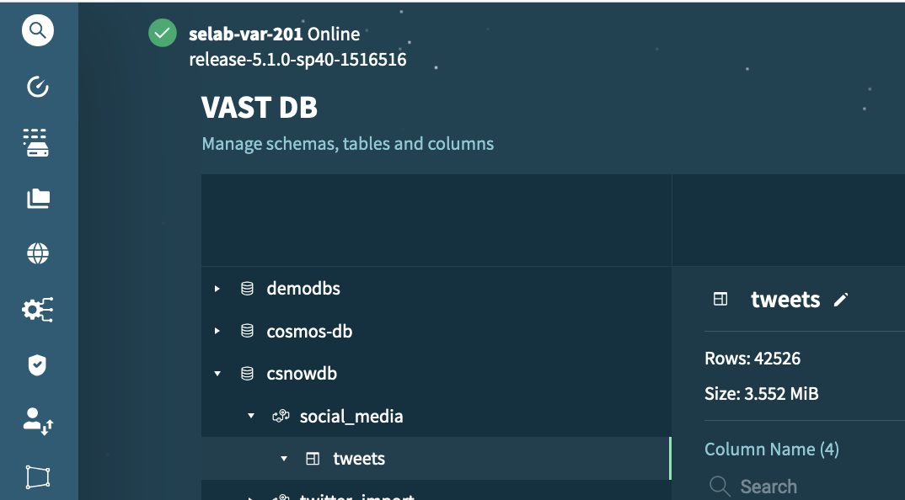

# Demonstrating the Streaming Lakehouse

> [!NOTE]
> The demo environment is running small docker instances.  Don't expect snappy response times.

## Endpoints

From the root project repo, run:

```bash
./scripts/endpoints_all.sh
```

Make a note of your project endpoints.

## Start Tweet Simulator

In this section we start producing tweets that are sent to Kafka.

Open the NiFi url (see [endpoints](#endpoints), above).

- Double Click on **Demo_Flow** to open it
- Double Click on **Streaming** to open it
- Double Click on **Publish to Kafka** to open it
  - Note the counters should be zero
  - Right Click on the Canvas background and click **Start**
  - Notice the counters start incementing
 
Open the Kafka console url (see [endpoints](#endpoints), above).

- Click on the **Topics** left menu option
- Click on the **streaming-demo** topic
- Click the **refresh icon** a few times to ensure the topic is receiving new data


- You cann also click the **refresh icon** in the messages box to view new messages arrive in real-time.

## Save Tweets to the Vast DB 

In this section we start consuming the tweets that were sent to Kafka and we save them in the Vast DB.

Open the NiFi url (see [endpoints](#endpoints), above).

- Right Click on the Canvas background and click **Enable All Controller Services**
- Double Click on **Demo_Flow** to open it
- Double Click on **Streaming** to open it
- Double Click on **Consume from Kafka** to open it
- Right Click on **ConsumeKafka - streaming-demo** Processor and Click **Start**
  - Wait until you have some records in the **success queue**
- Work down the connecting flows and start all of the connected processors except **Log Message**
  - Wait until the **PutVastDB** processor has non-zero counters
  - Double Click on the **PutVastDB** processor to verify where the data is getting saved.
- Navigate to your Vast VMS.  Verify that the row count is increasing


 
## View Tweets in Superset

In  this section, we query the tweets in real-time using Apache Superset.

### SQL Lab

Open the Superset url (see [endpoints](#endpoints), above).

- In the Superset toolbar, click on **SQL** >> **SQL Lab**
- On left side of page, set the following options:
  - **Database**: Trino VastDB
  - **Schema**: Your Schema
  - **Table**: Your Table
- Run the following query a few times (replace `csnowdb|social_media".tweets` with your details):

```sql
SELECT
  format_datetime(from_unixtime(CAST(created_at / 1000 AS bigint)), 'yyyy/MM/dd HH:mm:ss') AS formatted_time,
  id,
  text
FROM "csnowdb|social_media".tweets
ORDER BY created_at DESC
LIMIT 5
```
### Dashboard

Open the Superset url (see [endpoints](#endpoints), above).

- In the Superset toolbar, click on **Dashboards**
- Locate and open the **Quick VAST Dashboard**
- Click the button with the 3 dots on the top right
- Click **Set auto-refresh interval**
- Set to 10 secs

You should see the tweet count and latest tweets change every 10 seconds.

## Copy tweets to Iceberg

In this section, we perform a federated query to populate Iceberg on Vast S3 with data from Vast DB.

> [!NOTE]
> We limit records to around 100 so we don't overwhelm the (small) infrastructure used for the demo services.

- On left side of page, set the following options:
  - **Database**: Trino Vast Iceberg
  - **Schema**: social_media
  - **Table**: twitter_data
- Ignore the Superset error, this is a Superset [bug](https://github.com/apache/superset/issues/25307)

```sql
SELECT *
FROM iceberg.social_media.twitter_data
LIMIT 100
```
This should return no records.

Now run a federated query joining Iceberg and Vast DB:

```sql
INSERT INTO iceberg.social_media.twitter_data
(
  SELECT
    created_at as VARCHAR,
    id,
    id_str,
    text
  FROM vast."csnowdb|social_media".tweets
  LIMIT 100
)
```

Finally, rerun `SELECT * ...` to verify records have been written to iceberg.

## Querying with Spark

In this section we use Spark to query the data in Iceberg and Vast DB.

Open the Jupyter-Spark url (see [endpoints](#endpoints), above).

- Navigate to the **examples** folder
- Open the **Spark_Tweet_Demo.ipynb** notebook
- Run all the cells in the notebook 

## Publish to Kafka from Spark

In this section we use Spark to write data to Kafka.

Open the Jupyter-Spark url (see [endpoints](#endpoints), above).

- Navigate to the **examples** folder
- Open the **Kafka_Tweet_Demo.ipynb** notebook
- Run all the cells in the notebook

This publishes a tweet to a new topic `streaming-demo-2` with the topic about `SPARK`.

It is left as an exercise for the user to figure out how to consume this tweet.

> [!TIP]
> Look at the **Consume from Kafka** NiFi flow - there is a set of processors you haven't run yet.

## Stop publishing tweets

When you have finished demonstrating, stop the **Produce to Kafka** processors to prevent filling your environment up with data.
