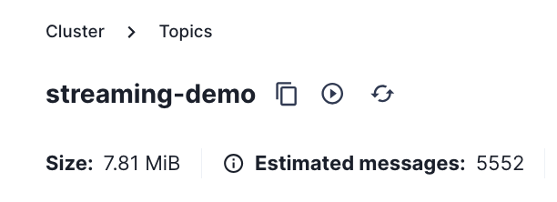

# Demonstrating the Streaming Lakehouse

## Endpoints

From the root project repo, run:

```bash
./scripts/endpoints_all.sh
```

Make a note of your project endpoints.

## Start Tweet Simulator

In this section we start producing tweets that are sent to Kafka.

Open the NiFi url (see [endpoints](#endpoints), above).

- Right Click on the Canvas background and click **Enable All Controller Services**
- Double Click on **Demo_Flow** to open it
- Double Click on **Streaming** to open it
- Double Click on **Publish to Kafka** to open it
  - Note the counters should be zero
  - Right Click on the Canvas background and click **Start**
  - Notice the counters start incementing
 
Open the Kafka console url (see [endpoints](#endpoints), above).

- Click on the **Topics** left menu option
- Click on the **streaming-demo** topic
- Click the **refresh icon** a few times to ensure the topic is receiving new data



- You cann also click the **refresh icon** in the messages box to view new messages arrive in real-time.

## Save Tweets to the Vast DB 

In this section we start consuming the tweets that were sent to Kafka and we save them in the Vast DB.

Open the NiFi url (see [endpoints](#endpoints), above).

- Right Click on the Canvas background and click **Enable All Controller Services**
- Double Click on **Demo_Flow** to open it
- Double Click on **Streaming** to open it
- Double Click on **Consume from Kafka** to open it
- Right Click on **ConsumeKafka - streaming-demo** Processor and Click **Start**
  - Wait until you have some records in the **success queue**
- Work down the connecting flows and start all of the connected processors except **Log Message**
  - Wait until the **PutVastDB** processor has non-zero counters
  - Double Click on the **PutVastDB** processor to verify where the data is getting saved.
- Navigate to your Vast VMS.  Verify that the row count is increasing


 
 

## More coming soon ...
