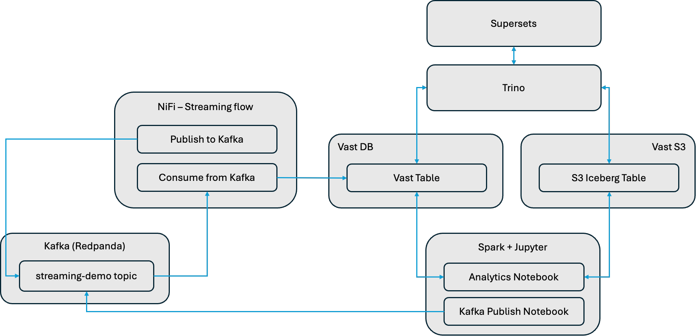

# Streaming Lakehouse

The primary purpose of this example is to demonstrate how streaming data into the Vast Database using NiFi.  This is highlighted in the streaming flow, below.  

> [!TIP]
> - See this [blog](https://www.vastdata.com/blog/the-data-lake-dilemma) for more information on issues with streaming into data lakehouse technologies like Iceberg, Delta and Hudi.
> - See the [iceberg docs](https://iceberg.apache.org/docs/latest/spark-structured-streaming/#maintenance-for-streaming-tables) for the concerns with streaming data into Iceberg.

## Streaming Flow

This example uses a NiFi flow generate the creation of random tweets in realtime (using a NiFi ScriptProcessor).  The Tweets are published to a Kafka topic.

A separate NiFi flow consumes from the Kafka topic and saves the tweets to the Vast DB.  Spark and Trino can be used to query from Iceberg tables that are stored on Vast S3 or from data in the Vast Database.  Queries can join data from both sources.  In addition Superset is configured to use Trino to provide a UI for data visualization and exploration.

Finally, a Spark Kafka notebook demonstrates how spark can be used to write to Kafka.

## Support

- Vast Data provides support for Vast Datastore (S3), Vast Database, Vast DataEngine (Spark)
- Support for the other components can be obtained from Vast Data partner, [Stackable](https://stackable.tech/en/):
  - Kafka
  - NiFi
  - Superset
  - Trino

## Prerequisites

- Host with:
  - approx. 24GB Memory
  - approx. 8 Cores
  - approx. 300GB Storage free
  - Docker Compose (installed from [here](https://docs.docker.com/engine/install/))
- Vast S3 Bucket
- Vast Database
  
## Setup Instructions

See [here](../SETUP_INSTRUCTIONS.md).

## Demonstrating this workflow

See [here](./DEMONSTRATING.md).

