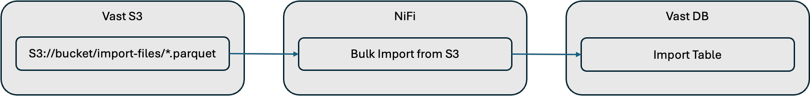

# Streaming Lakehouse

The primary purpose of this example is to demonstrate how streaming data into the Vast Database using NiFi.  This is highlighted in the streaming flow, below.  

> [!TIP]
> See this [blog](https://www.vastdata.com/blog/the-data-lake-dilemma) for more information on issues with streaming into data lakehouse technologies like Iceberg, Delta and Hudi.

## Streaming Flow

This example uses a NiFi flow generate the creation of random tweets in realtime (using a NiFi ScriptProcessor).  The Tweets are published to a Kafka topic.

A separate NiFi flow consumes from the Kafka topic and saves the tweets to the Vast DB.  Spark and Trino can be used to query from Iceberg tables that are stored on Vast S3 or from data in the Vast Database.  Queries can join data from both sources.  In addition Superset is configured to use Trino to provide a UI for data visualization and exploration.

Finally, a Spark Kafka notebook demonstrates how spark can be used to write to Kafka.


## Bulk Import

Bulk Import uses a NiFi ListS3 processor to monitor a S3 folder for new parquet files.  It then calls a Vast DB processor, ImportVastDB to bulk load the files into a Database table.

You can find out more bulk importing with NiFi [here](https://vast-data.github.io/data-platform-field-docs/vast_database/nifi/bulk_import.html).



## Prerequisites

- Docker Compose
- Host with:
  - approx. 24GB Memory
  - approx. 8 cores
- Vast S3 Bucket
- Vast Database

## Getting Started

- Clone this git repository.
- Copy `.env-example` to `.env-local` in the repo root folder and update it to reflect your environment
- Run the following projects:
  - [hive3x](../../hive3x)
  - [kafka](../../kafka)
  - [nifi](../../nifi)
    - Upload the [NiFi Flow File](./assets/NiFi_Flow.json) 
  - [jupyter-pyspark](../../jupyter-pyspark)
  - [trino](../../trino)
  - [superset](../../superset)
  
## Detailed Setup Instructions

### Clone repo and configure

- Clone this git repository.
- Copy `.env-example` to `.env-local` in the repo root folder and update it to reflect your environment:
  - DOCKER_HOST_OR_IP
  - S3A_ACCESS_KEY
  - S3A_SECRET_KEY
  - S3A_ENDPOINT
  - VASTDB_ACCESS_KEY
  - VASTDB_SECRET_KEY
  - VASTDB_ENDPOINT

### Hive3x 

```bash
cd hive3x
docker compose up -d 
```

### More coming soon ...


